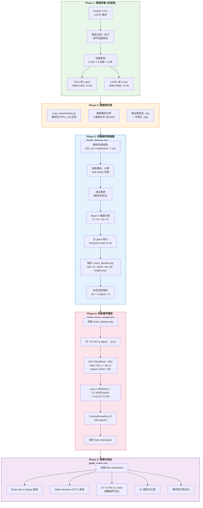
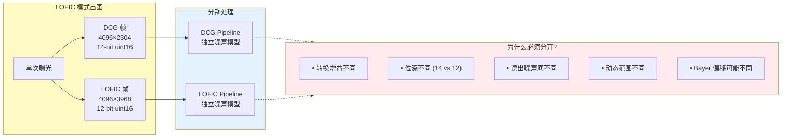
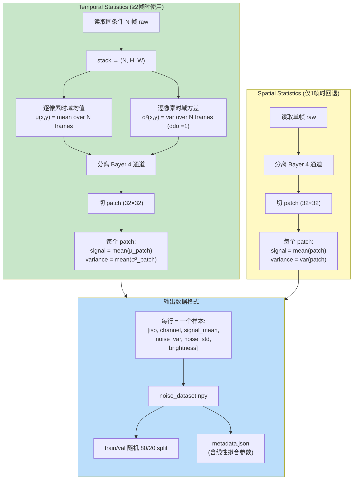
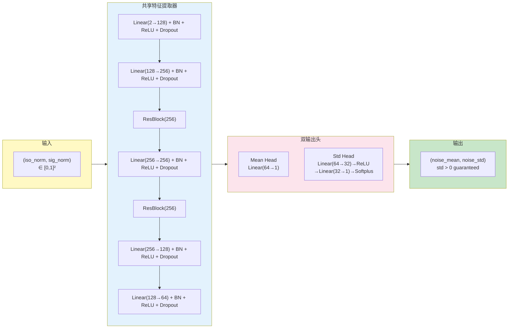

# Pocket 4 Pro Sensor Noise Model Calibration Pipeline

基于 noise2noise 工程，利用实验室采集的多帧 RAW 数据，
通过 temporal 统计提取 + MLP 回归，完成传感器噪声参数标定。

---

## 1. 整体数据流（基于你的 Pocket 4 Pro 数据）

### 1.1 从数据采集到噪声模型的完整 Pipeline



### 1.2 DCG 与 LOFIC 双模处理策略



### 1.3 噪声统计量提取细节 (build_dataset.py 核心逻辑)



### 1.4 MLP 噪声模型架构



---

## 2. 工程构建指南

### 2.1 项目结构

```
noise2noise-pytorch-master/
├── configs/
│   └── train_noise_model.yml        # 主配置文件 ← 修改这里
├── src/
│   ├── build_dataset.py             # Step 1: 从 raw 构建噪声数据集
│   ├── noise_dataset.py             # PyTorch Dataset
│   ├── noise_model.py               # MLP 噪声模型 + 线性基线
│   ├── train_noise_model.py         # Step 2: 训练噪声模型
│   ├── infer_noise.py               # Step 3: 推理与可视化
│   ├── noise2noise.py               # (另一条线) Noise2Noise 去噪器
│   ├── unet.py                      # U-Net 架构 (去噪用)
│   ├── train.py                     # N2N 去噪训练入口
│   ├── test.py                      # N2N 去噪测试入口
│   ├── datasets.py                  # 合成噪声数据集
│   ├── render.py                    # MC 渲染
│   └── utils.py                     # 工具函数
├── crop_colorchecker.py             # 色卡裁剪工具
└── requirements.txt
```

### 2.2 环境搭建

```bash
# 1. 创建环境
conda create -n noise_model python=3.10 -y
conda activate noise_model

# 2. 安装依赖
pip install torch torchvision numpy matplotlib Pillow pyyaml

# 3. (可选) TensorBoard 监控训练
pip install tensorboard
```

### 2.3 数据准备

你的原始数据需要组织为以下结构:

```
raw_data_dcg/                        # DCG 帧数据根目录
├── ISO100/
│   ├── 12.5/                        # 亮度百分比 (必须是数字)
│   │   ├── frame_001.raw
│   │   ├── frame_002.raw
│   │   └── ...                      # 同条件多帧 (越多越好, ≥10帧推荐)
│   ├── 25/
│   ├── 37.5/
│   ├── 50/
│   ├── 62.5/
│   ├── 75/
│   ├── 87.5/
│   ├── 100/
│   └── dark/                        # 黑帧 (盖镜头盖拍摄)
├── ISO200/
│   └── ...
├── ISO400/
├── ISO800/
└── ISO1600/

raw_data_lofic/                      # LOFIC 帧数据根目录 (同结构)
└── ...
```

**注意**: 你现有的 `light1/light2/light3` 结构需要改名为亮度百分比数字,
或者修改 `build_dataset.py` 的目录解析逻辑 (见后文审查部分)。

### 2.4 修改配置文件

编辑 `configs/train_noise_model.yml`:

**DCG 模式配置:**
```yaml
data:
  raw_dir: "/path/to/raw_data_dcg"
  dataset_dir: "./noise_dataset_dcg"
  raw_width:  4096
  raw_height: 2304
  bit_depth:  14
  packed:     false
  bayer_pattern: "BGGR"
  patch_size: 32
```

**LOFIC 模式配置:**
```yaml
data:
  raw_dir: "/path/to/raw_data_lofic"
  dataset_dir: "./noise_dataset_lofic"
  raw_width:  4096
  raw_height: 3968
  bit_depth:  12
  packed:     false
  bayer_pattern: "BGGR"
  patch_size: 32
```

### 2.5 运行三步流程

```bash
cd src/

# ── Step 1: 构建数据集 ──
python build_dataset.py --config ../configs/train_noise_model.yml

# ── Step 2: 训练模型 ──
python train_noise_model.py --config ../configs/train_noise_model.yml --cuda

# ── Step 3: 推理与可视化 ──
python infer_noise.py \
  --config ../configs/train_noise_model.yml \
  --checkpoint ../ckpts/noise_model/noise_model_best.pth

# ── (可选) TensorBoard 监控 ──
tensorboard --logdir ../runs/noise_model
```

---

## 3. `build_dataset.py` 代码审查报告

### 5.0 审查总览

```
┌──────────────────────────────────────────────────────────────┐
│  总体评价:  基础框架合理，但有 3 个关键问题需要修复           │
│  CRITICAL : 2 个 (会导致你的数据无法处理或结果错误)          │
│  IMPORTANT: 5 个 (影响噪声标定精度)                          │
│  MINOR    : 4 个 (代码质量 / 健壮性)                         │
└──────────────────────────────────────────────────────────────┘
```

### 5.1 CRITICAL -- 必须修复

#### [C1] 目录结构与你的数据不匹配 (line 172-213)

**问题**: `parse_data_dirs()` 期望亮度子目录名为 **数字**（如 `12.5/`, `25/`），
但你描述的实际目录结构是 `light1/`, `light2/`, `light3/`。

```python
# line 200-202: 非数字目录名会被跳过
try:
    brightness = float(br_name)     # float("light1") → ValueError
except ValueError:
    continue                         # ← 你的所有数据都会被跳过！
```

**影响**: 脚本会报 "No valid ISO/brightness directories found" 然后退出,
一条数据都处理不了。

**修复方案**: 二选一 —
1. **改数据目录名**: 将 `light1/` 改为 `12.5/`, `light2/` 改为 `25/`, ...
2. **改代码**: 添加 `lightN` 到亮度值的映射 (见下文修复建议)

---

#### [C2] RAW 文件读取未指定字节序 (line 57)

**问题**: `np.fromfile(filepath, dtype=np.uint16)` 使用系统原生字节序,
而你的 `.raw` 文件明确是 little-endian uint16。

```python
# 当前代码
dtype = np.uint8 if bit_depth <= 8 else np.uint16

# 应该改为
dtype = np.uint8 if bit_depth <= 8 else np.dtype('<u2')  # 明确 LE
```

**影响**: 在 big-endian 系统上会静默产生错误数据。虽然 x86 是 LE 所以
目前可能碰巧正确，但这是一个 portability bug，且不显式指定字节序是
处理 raw sensor 数据的常见错误来源。

---

### 5.2 IMPORTANT -- 影响标定精度

#### [I1] 空间统计 fallback 对色卡场景不可靠 (line 253-272)

**问题**: 当只有 1 帧时，使用空间方差作为噪声方差估计。
但色卡场景有颜色块边界、渐变等空间结构，**空间方差 = 噪声方差 + 场景结构方差**。

```python
var = float(np.var(patch))  # 包含了场景信息，不纯是噪声
```

**影响**: 会严重高估噪声方差，尤其在色卡色块边界附近的 patch。

**建议**: 由于你每个条件都有多帧 (light1,2,3...)，应该确保每个条件至少 2 帧，
完全使用 temporal 统计路径，**禁用 spatial fallback**，或者至少打印警告。

---

#### [I2] 空间方差使用有偏估计 (line 270)

**问题**: `compute_spatial_stats` 用 `np.var(patch)` (ddof=0, 有偏),
而 `compute_temporal_stats` 用 `np.var(..., ddof=1)` (无偏), 不一致。

```python
# temporal (正确):
temporal_var = np.var(stacked, axis=0, ddof=1)

# spatial (应加 ddof=1):
var = float(np.var(patch))   # ← 缺少 ddof=1
```

**影响**: 对 32×32 patch (1024 pixels), 偏差约 0.1%, 影响很小。
但对更小的 patch 或者如果以后调小 patch_size，偏差会更大。

---

#### [I3] 无异常像素过滤 (hot pixel / dead pixel)

**问题**: CMOS 传感器必然存在 hot pixels（暗电流异常高的像素）和
dead pixels（始终输出 0 的像素）。这些像素会污染 patch 级别的统计。

**影响**: 少量 hot pixel 可能导致个别 patch 的方差被异常拉大,
产生离群点（outlier）。在 PTC 图上表现为散点云中的异常高点。

**建议**: 添加简单的 3σ 剔除或中值绝对偏差 (MAD) 滤波:
```python
# 示例: 对每个 patch 做 3σ clip
median = np.median(patch)
mad = np.median(np.abs(patch - median))
mask = np.abs(patch - median) < 5 * mad * 1.4826
var = float(np.var(patch[mask], ddof=1))
```

---

#### [I4] 线性模型拟合不区分 Bayer 通道 (line 354-365)

**问题**: 线性拟合 `var = a·signal + b` 是 **per-ISO** 的,
但把 R/Gr/Gb/B 四个通道的数据混在一起拟合。

不同颜色通道的量子效率 (QE) 和读出噪声不同，应该分别拟合。

```python
# 当前: 所有通道混合
mask = data[:, 0] == iso_val

# 应该改为: per-ISO per-channel
for ch in range(4):
    mask = (data[:, 0] == iso_val) & (data[:, 1] == ch)
```

**影响**: 拟合出的 (a, b) 是四个通道的平均值，会掩盖通道间差异。
对 ISP tuning 来说，通道级参数更有价值。

---

#### [I5] Train/Val 划分存在数据泄露 (line 370-374)

**问题**: 随机按样本索引划分，来自**同一帧/同一条件**的 patch 可能
同时出现在 train 和 val 中。由于相邻 patch 的统计高度相关，
这会导致 val loss 过于乐观。

```python
idx = np.random.RandomState(42).permutation(n)
split = int(0.8 * n)
# ← 同一帧的不同 patch 可能分到不同 set
```

**建议**: 按 (ISO, brightness) 条件划分, 或按帧划分:
```python
# 按条件划分: 留出某些 brightness 档位做 val
# 例如: val = {37.5%, 87.5%}, train = 其余
```

---

### 5.3 MINOR -- 代码质量建议

#### [M1] 全程使用 float64, 内存浪费

LOFIC 帧: 4096×3968×8 bytes = 130 MB/帧。20 帧堆叠 = 2.6 GB。
改为 float32 精度完全够用（14-bit 数据只需要 ~17 bit 有效精度）。

#### [M2] 无进度提示

处理大量文件时没有进度条，长时间运行看不到进展。

#### [M3] 无坏帧检测

不检查文件大小是否匹配预期、是否全零（存储故障）、是否有 NaN。

#### [M4] 缺少 dark frame 的 per-ISO 回退

如果某个 ISO 没有拍黑帧，该 ISO 的所有数据不做暗电流校正 (line 324),
但代码不打印任何警告。应至少 warn 或使用最近 ISO 的 dark frame。

---

### 5.4 修复建议汇总

下面是针对你的 Pocket 4 Pro 场景的优先级修复清单:

```
优先级    问题    工作量    影响
──────    ────    ──────    ────
P0        C1      低        不修就跑不起来
P0        C2      低        字节序问题
P1        I1      低        禁用 spatial fallback 或确保多帧
P1        I3      中        添加 hot pixel 过滤
P1        I4      低        线性拟合改为 per-channel
P2        I5      中        改进 train/val 划分策略
P2        I2      低        加 ddof=1
P3        M1-M4   低        代码质量改进
```
